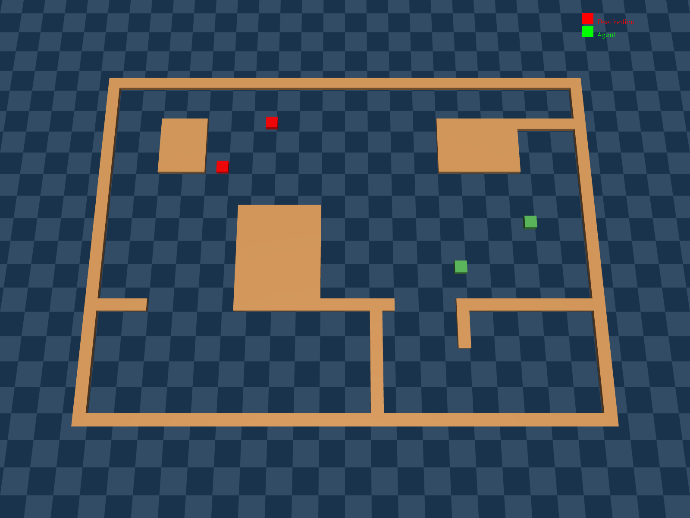

[](https://pre-commit.com/)
[](https://github.com/psf/black)


This library contains a collection of Reinforcement Learning in Engineering Simulation environments that use the [Gymnasium](https://gymnasium.farama.org/) and [Gymnasium Robotics](https://robotics.farama.org/) API. The environments run with the [MuJoCo](https://mujoco.org/) physics engine and the maintained [mujoco python bindings](https://mujoco.readthedocs.io/en/latest/python.html).


## Installation

To install the Engineering-Sim environments use `pip install -e .`

These environments also require the MuJoCo engine from Deepmind to be installed. Instructions to install the physics engine can be found at the [MuJoCo website](https://mujoco.org/) and the [MuJoCo Github repository](https://github.com/deepmind/mujoco).

We support and test for Linux and macOS. We will accept PRs related to Windows, but do not officially support it.

## Environments

`Engineering-Sim` includes the following groups of environments:

* Single Agent Path Planning - An agent finds the path to fetch the target.

* Multi Agent Path Planning - Multiple agents find the paths to fetch the corresponding targets.

* Single Agent Obstacle Avoidance - An agent finds the path to fetch the target and avoid the obstacle.

* Multi Agent Obstacle Avoidance -  Multiple agents find the paths to fetch the corresponding targets and avoid the obstacles.

* Single Agent RobotArm - An agent flattens the cement by vibration.

* Multi Agent RobotArm - Multiple agents flatten the cement by vibration.

|Environment|              Vertical View          |           Oblique Drawing               |
|:---:|:-------------------------:|:-------------------------:|
|Single Agent Path Planning |  |  |
|Multi Agent Path Planning|  |  |
|Single Agent Obstacle Avoidance|  |  |
|Multi Agent Obstacle Avoidance|  |  |
|Single Agent RobotArm|  |  |
|Multi Agent RobotArm|  |  |

The offline datasets are listed as below (Others will be coming soon!).
|Environment|Data Type|Download Link|
|:---:|:-------------------------:|:-------------------------:|
|Single Agent Path Planning|Random|https://cloud.tsinghua.edu.cn/d/a45bb47294154288a351/|
|Multi Agent Path Planning|Random|https://cloud.tsinghua.edu.cn/d/860404761ba84c8185ba/|
|Single Agent Obstacle Avoidance|Random|https://cloud.tsinghua.edu.cn/d/f438681b273743119736/|
|Multi Agent Obstacle Avoidance|Random|https://cloud.tsinghua.edu.cn/d/30b121e9caa4452f83d7/|
|Single Agent RobotArm|Random|https://cloud.tsinghua.edu.cn/d/dacde3bd82c04f9ea246/|
|Multi Agent RobotArm|Random|https://cloud.tsinghua.edu.cn/d/0a1720bb268342dab3c9/|


## Usage Instruction

These instructions describe how to load the engineering simulator environment, create tasks, interact with the environment, and other operations.

```python
import gymnasium as gym
import engineering_sim
gym.register_envs(engineering_sim) 
#environment registeration

env = gym.make("PointMaze_PATHPLANNING_MAP1Dense-v3") 
#env = gym.make('PointMaze_MA_PATHPLANNING_MAP1Dense-v3')
#env = gym.make('PointMaze_BARRIER_PATHPLANNING_MAP1Dense-v3')
#env = gym.make('PointMaze_MA_BARRIER_PATHPLANNING_MAP1Dense-v3')
#env = gym.make("RobotsArmEngSim-v4")
#env = gym.make("MultiRobotsArmEngSim-v4") 
#environment generation

env.reset()
obs, reward, terminated, truncated, info = env.step(env.action_space.sample())
#environment interaction
```

## Project Maintainers
Main Contributors: [Zhuoran Li](https://scholar.google.com.hk/citations?user=j948XtQAAAAJ&hl=zh-CN)

Guidance: Professor [Longbo Huang](https://iiis.tsinghua.edu.cn/~huang)


## Citation

If you use this in your research, please cite:
```
@software{engineering_sim2025github,
  author = {Zhuoran Li, Longbo Huang},
  title = {Engineering Sim},
  version = {0.0.1},
  year = {2025},
}
```
