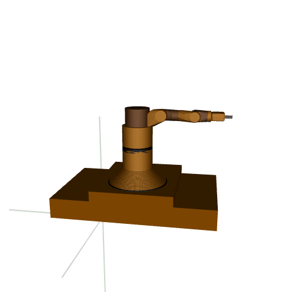
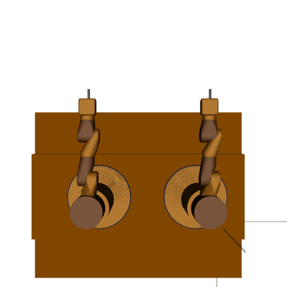
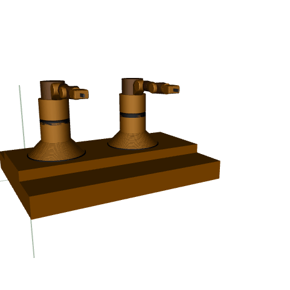

[](https://pre-commit.com/)
[](https://github.com/psf/black)


This library contains a collection of Reinforcement Learning in Engineering Simulation environments that use the [Gymnasium](https://gymnasium.farama.org/) and [Gymnasium Robotics](https://robotics.farama.org/) API. The environments run with the [MuJoCo](https://mujoco.org/) physics engine and the maintained [mujoco python bindings](https://mujoco.readthedocs.io/en/latest/python.html).


## Installation

To install the Engineering-Sim environments use `pip install -e .`

These environments also require the MuJoCo engine from Deepmind to be installed. Instructions to install the physics engine can be found at the [MuJoCo website](https://mujoco.org/) and the [MuJoCo Github repository](https://github.com/deepmind/mujoco).

We support and test for Linux and macOS. We will accept PRs related to Windows, but do not officially support it.

## Environments

`Engineering-Sim` includes the following groups of environments:

* Single Agent Path Planning - An agent finds the path to fetch the target.

* Multi Agent Path Planning - Multiple agents find the paths to fetch the corresponding targets.

* Single Agent Obstacle Avoidance - An agent finds the path to fetch the target and avoid the obstacle.

* Multi Agent Obstacle Avoidance -  Multiple agents find the paths to fetch the corresponding targets and avoid the obstacles.

* Single Agent RobotArm

* Multi Agent RobotArm

|Environment|              Vertical View          |           Oblique Drawing               |
|:---:|:-------------------------:|:-------------------------:|
|Single Agent Path Planning|  |  |
|Multi Agent Path Planning|  |  |
|Single Agent Obstacle Avoidance|  |  |
|Multi Agent Obstacle Avoidance|  |  |
|Single Agent RobotArm|  |  |
|Multi Agent RobotArm|  |  |


The dataset for Offline Reinforcement Learning will be released later!


## Multi-goal API

The robotic environments use an extension of the core Gymnasium API by inheriting from [GoalEnv](https://robotics.farama.org/content/multi-goal_api/) class. The new API forces the environments to have a dictionary observation space that contains 3 keys:

* `observation` - The actual observation of the environment
* `desired_goal` - The goal that the agent has to achieved
* `achieved_goal` - The goal that the agent has currently achieved instead. The objective of the environments is for this value to be close to `desired_goal`
* `barrier_goal` (Optional) - The barrier position

This API also exposes the function of the reward, as well as the terminated and truncated signals to re-compute their values with different goals. This functionality is useful for algorithms that use Hindsight Experience Replay (HER).

The following example demonstrates how the exposed reward, terminated, and truncated functions
can be used to re-compute the values with substituted goals. The info dictionary can be used to store
additional information that may be necessary to re-compute the reward, but that is independent of the
goal, e.g. state derived from the simulation.

```python
import gymnasium as gym

env = gym.make("PointMaze_PATHPLANNING_MAP1Dense-v3") 
#env = gym.make('PointMaze_MA_PATHPLANNING_MAP1Dense-v3')
#env = gym.make('PointMaze_BARRIER_PATHPLANNING_MAP1Dense-v3')
#env = gym.make('PointMaze_MA_BARRIER_PATHPLANNING_MAP1Dense-v3')
#env = gym.make("RobotsArmEngSim-v4", render_mode="rgb_array")
#env = gym.make("MultiRobotsArmEngSim-v4", render_mode="rgb_array")
env.reset()
obs, reward, terminated, truncated, info = env.step(env.action_space.sample())

# The following always has to hold:
assert reward == env.compute_reward(obs["achieved_goal"], obs["desired_goal"], info)
assert truncated == env.compute_truncated(obs["achieved_goal"], obs["desired_goal"], info)
assert terminated == env.compute_terminated(obs["achieved_goal"], obs["desired_goal"], info)

# However goals can also be substituted:
substitute_goal = obs["achieved_goal"].copy()
substitute_reward = env.compute_reward(obs["achieved_goal"], substitute_goal, info)
substitute_terminated = env.compute_terminated(obs["achieved_goal"], substitute_goal, info)
substitute_truncated = env.compute_truncated(obs["achieved_goal"], substitute_goal, info)
```

The `GoalEnv` class can also be used for custom environments.

## Project Maintainers
Main Contributors: [Zhuoran Li](https://scholar.google.com.hk/citations?user=j948XtQAAAAJ&hl=zh-CN)


## Citation

If you use this in your research, please cite:
```
@software{engineering_sim2025github,
  author = {Zhuoran Li},
  title = {Engineering Sim},
  version = {0.0.1},
  year = {2025},
}
```
